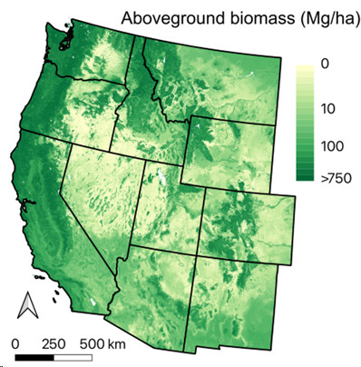

## Project overview

The US Forest Service (USFS) and other public and private land managers continue to acquire airborne lidar collections over large swaths of forest in the western US. Our two previous CMS projects (Phases 1 and 2, 2015-2023) cumulatively assembled 9,988 field plots in 604 lidar project areas covering a 1.2M km^2^ patchwork of forested land across the western US. Current (Phase 3, 2023-2027) work will continue to assemble and process new project lidar and field plot datasets as they are collected by our expanding assemblage of stakeholders. As more stakeholder data is acquired and contributed, the accuracy and precision of our 30m annual (1985-2025) forest aboveground biomass products should continue to improve. By the same modeling approach (machine learning using Random Forests), we are also mapping other forest attributes at 30m resolution to foster engagement with and use by our stakeholders.

The final products are bias corrected using independent, design-based National Forest Inventory plot data, from which we can also calculate and report model uncertainty at 30m resolution. New Phase 3 objectives include evaluating whether GEDI and ICESat-2 satellite lidar measurements of canopy height available since 2019 can increase AGB map precision and reduce uncertainty, and if so, ingesting these data into our workflow. Our most novel Phase 3 objective is to disaggregate estimates of biomass and generate tree lists at 30m resolution. Tree lists are the currency of forest planners and managers, who need estimates of both merchantable (i.e., lumber) and non-merchantable (e.g., foliage) biomass components, and tree species and size classes. Tree lists empower managers with this flexibility, not just for carbon management, but also to meet timber, fuel, and wildlife habitat management objectives.

## Geospatial products:

We produced various geospatial datasets for managing western US forests. Our methodology included estimating important forest attributes (e.g., aboveground biomass, canopy fuel load) using stakeholder plot data for available lidar data acquisitions. Subsequently, the data were scaled across space and time using Landsat timeseries creating annual wall-to-wall datasets from 1985 to 2020 at 30m spatial resolution. The final products are bias-corrected using independent (i.e., withheld from model building) USFS Forest Inventory and Analysis (FIA) plot data. We also provide 30m uncertainty maps.

{fig-align="center" width="350"}

## Data use for natural resource managers:

This data is valuable for quantifying/baselining/monitoring forest carbon stocks, assessing spatial distribution of fuels, quantifying timber volume across large areas, assessing wildfire risk, investigating wildlife distributions, and other natural resource management applications.

## Data summary:

-   Timber attributes: basal area, trees per hectare, stand density index, quadratric mean diameter, volume, above ground biomass, etc.

-   Fuel attributes: canopy base height, canopy bulk density, canopy fuel load, etc.

-   Wildlife attributes: snag density, crown competition factor

-   Spatial resolution & extent: 30-m, western USA

-   Temporal resolution & extent: Annual, 1985-2020 (update to present in progress)

-   Precision: R^2^: 0.81, RMSE: 47.3 Mg/ha (e.g., for 2020 ABG; available for other attributes)

## Data availability:

Data are currently available by individual request but will be made permanently available through the ORNL-DAAC and other public data repositories.

## Help us improve our prdducts

We are conducting a survey to improve our products for a third phase of our project. If you use or produce geospatial data for natural resource management, please take our survey. You can scan the following QR code or directly use this [Link](https://forms.office.com/r/TSx9CYnGnw). Thank you very much for your valuable input.

{fig-align="center"}
