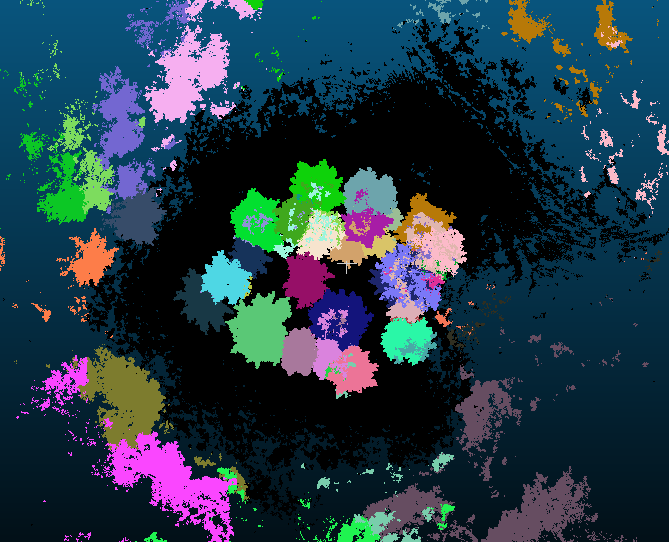
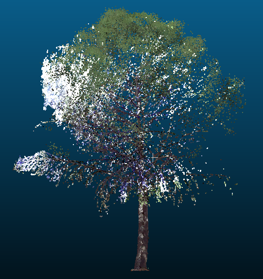
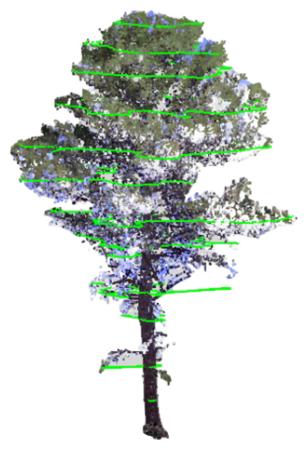

# Perfiles de copa (Crown-profiles)

Este paquete de trabajo incluye dos tareas en las que implementamos los pasos necesarios para desarrollar modelos de perfil de copa para *Pinus halepensis Mill.*, una especie muy afectada por incendios forestales. La falta de modelos de perfil de copa para esta especie implica que los parámetros de combustible de copa se derivan mediante supuestos simplificados. La integración de los modelos de perfil de copa desarrollados en este paquete de trabajo con los datos de SNFI dará como resultado listas de árboles mapeados más realistas y mapas de combustible de copa más adecuados para la integración con simuladores de propagación de incendios.

## Tarea 1.1. Adquisición de datos terrestres y con drones

### Características de las parcelas.

En total se han estudiado 68 parcelas con un radio de 17 metros cada una, en seis zonas diferentes del entorno de la cordillera ibérica.

-   10 parcelas por el término municipal de Ardisa (Zaragoza)

-   12 parcelas en Astudillo (Palencia)

-   12 parcelas en Cifuentes (Guadalajara)

-   11 en Fitero (Navarra)

-   11 parcelas en Torrijo (Teruel)

-   12 parcelas en San Esteban de Gormaz (Soria)

```{r}
#| echo: false
#| warning: false
#| error: false
#| message: false
#| results: 'hide'
#| label: setup

# Cargar librerías necesarias
pacman::p_load(sf, ggplot2, ggspatial, prettymapr, mapSpain, raster)

puntos <- sf::st_read("Y:/1_TLS_DRON/data/buffer_12m_centros.shp")
st_crs(puntos) <- 25830 
puntos_centroides <- st_centroid(puntos)
provincias_utm <- mapSpain::esp_get_prov() %>% st_transform(25830)

```

```{r}
#| echo: false
#| warning: false
#| error: false
#| label: mapa


ggplot() +
  # Añadir mapa base de OSM
  #annotation_map_tile(type = "cartolight", zoomin = 2) +
  geom_sf(data = provincias_utm, fill = NA, color = "grey60", size = 0.2) + # Límites provincias
  # Añadir los puntos del shapefile
  geom_sf(
      data = puntos_centroides, 
      aes(color = ZONA_2, shape = ZONA_2), 
      size = 2,
      alpha = 0.8
  ) +
  # Zoom automático a la zona donde están los datos
  #coord_sf(xlim = st_bbox(puntos)[c(1, 3)] + c(-300000, 300000), 
  #         ylim = st_bbox(puntos)[c(2, 4)] + c(-300000, 300000),
  #         datum = st_crs(25830)) +
  scale_color_brewer(palette = "Set1", name = "Zona: ") +
  scale_shape_manual(values = c(15, 16, 17, 18, 19), name = "Zona: ") +
  annotation_scale(location = "bl", width_hint = 0.2, style="ticks") + # Añade escala para referencia
  #annotation_north_arrow(location = "tr", which_north = "true") +
  # Ajustar tema
  theme_minimal() +
  theme(legend.position = "bottom") + # Mejora el espacio visual
  labs(title = "Distribución de las parcelas",
       x = NULL,
       y = NULL)
```

### Uso de escaner láser terrestre (TLS)

El escaner láser terrestre utilizado es . Se ha utilizado un enfoque multiescaneo, con al menos cinco posiciones y un máximo de nueve, dependiendo de la densidad de la parcela, para garantizar la cobertura total.

### Uso de drones o escaner láser aéreo no tripulado (ULS).

Los escaneos ULS han proporcionado una densidad final de 23000 puntos por metro cuadrado.

## Tarea 1.2. Modelado de la forma de la copa

Tras el registro conjunto de las nubes de puntos del TLS y el ULS, cada árbol a menos de 12 m del centro de la parcela se ha segmentado mediante un proceso de dos pasos. Primero, se ha utilizado el algoritmo de aprendizaje profundo TreeLearn para generar un conjunto preliminar de árboles segmentados. Luego, se han inspeccionado y refinado manualmente los resultados de TreeLearn, generando una nube de puntos limpia para cada árbol. El resultado fue un conjunto de datos con más de 900 gemelos digitales de los árboles escaneados.

::: {layout-ncol="2" style="text-align: center;"}
{.lightbox height="3in"}

{.lightbox height="3in"}
:::

### Segmentaciones de copas a diferentes alturas

Para cada árbol, se ha dividido la copa en secciones de 0,5 metros de ancho. Posteriormente, se obtienen las cubiertas cóncavas de cada corte con un parámetro de concavidad de 2 y un umbral de longitud máxima de 0,5 metros. A partir del conjunto de cubiertas cóncavas, se calculan las siguientes variables de respuesta a nivel de árbol:

::: {layout-ncol="2" layout-valign="center"}
{.lightbox height="2in"}

1.  Altura de la primera rama (HFB)

2.  Ancho máximo de copa (MCW)

3.  Altura a la que se alcanza el ancho máximo de copa (HMCW)

4.  Volumen total de copa (CV).
:::

Se ha realizado una regresión de estas variables frente a variables a nivel de árbol, como el diámetro a la altura del pecho y la altura del árbol, y variables a nivel de rodal, como el área basal y los índices de competencia.

### Desarrollo y validación de modelos

Los modelos ajustados han mostrado coeficientes de determinación del 73 %, 78 %, 92 % y 74 % para HFB, MCW, HMCW y CV, respectivamente. Hasta donde sabemos, este es el primer conjunto de modelos que permiten reconstruir los perfiles de copa de los árboles de pino carrasco en la Península Ibérica y proporcionan información detallada que puede utilizarse para mejorar las caracterizaciones de los combustibles del dosel de esta especie propensa a incendios.
